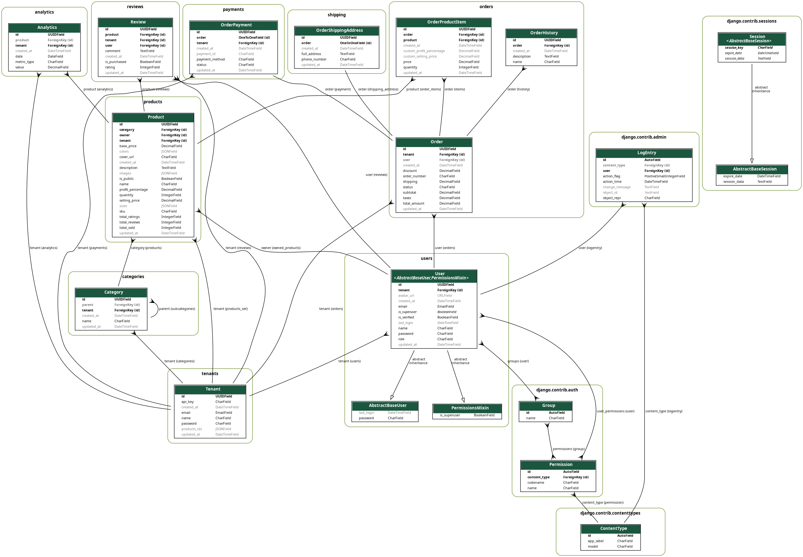

# ConnectX Backend

ConnectX is a robust Django-based backend application designed to power e-commerce platforms with comprehensive features for user management, product handling, order processing, and transaction tracking.

## 🌟 Features

- **User Management**

  - Role-based access control (Admin, Entrepreneur, Customer)
  - Secure authentication and authorization
  - User profile management

- **Product Management**

  - Category-based product organization
  - Inventory tracking
  - Product reviews and ratings

- **Order Processing**

  - Order creation and management
  - Status tracking
  - Order history

- **Transaction System**
  - Sales tracking
  - Restock management
  - Return processing
  - Payment integration

## 🚀 Quick Start

### Prerequisites

- Python 3.8+
- pipenv
- PostgreSQL (recommended)

### Installation

1. **Clone the repository:**

   ```bash
   git clone https://github.com/maajidAwol/ConnectX.git
   cd ConnectX/Backend
   ```

2. **Set up virtual environment and install dependencies:**

   ```bash
   pipenv install
   pipenv shell
   pipenv install --ignore-pipfile
   ```

3. **Configure environment variables:**
   Create a `.env` file in the project root with the following variables:

   ```
   DEBUG=True
   SECRET_KEY=your_secret_key
   DATABASE_URL=your_database_url
   ```

4. **Run migrations:**

   ```bash
   python manage.py migrate
   ```

5. **Create superuser:**

   ```bash
   python manage.py createsuperuser
   ```

6. **Start the development server:**
   ```bash
   python manage.py runserver
   ```

## 📚 API Documentation

The API documentation is available at `http://127.0.0.1:8000/api/docs/` when running the development server.

### Key Endpoints

- `/api/users/` - User management
- `/api/products/` - Product operations
- `/api/orders/` - Order processing
- `/api/transactions/` - Transaction handling

## 🧪 Testing

Run the test suite with:

```bash
python connectx_backend/manage.py test users products orders tenants categories payments shipping analytics reviews --noinput
```

## 📊 Database Schema

The project includes a visual representation of the database schema. To generate the schema diagram:

1. Install required packages:

   ```bash
   pipenv install django-extensions graphviz
   ```

2. Generate the schema:
   ```bash
   python manage.py graph_models -a -o schema.png
   ```
   

## 🔧 Development

### Code Style

- Follow PEP 8 guidelines
- Use meaningful variable and function names
- Add docstrings for all functions and classes
- Keep functions small and focused

### Error Handling

- Implement proper exception handling
- Log errors appropriately
- Return meaningful error messages
- Use HTTP status codes correctly

## 🤝 Contributing

1. Fork the repository
2. Create a feature branch (`git checkout -b feature/AmazingFeature`)
3. Commit your changes (`git commit -m 'Add some AmazingFeature'`)
4. Push to the branch (`git push origin feature/AmazingFeature`)
5. Open a Pull Request

### Pull Request Process

1. Update the README.md with details of changes if needed
2. Update the documentation
3. Ensure all tests pass
4. Follow the existing code style

## 📝 License

This project is licensed under the MIT License - see the [LICENSE](LICENSE) file for details.

## 🔗 Links

- [API Documentation](https://connectx-backend-295168525338.europe-west1.run.app)
- [Issue Tracker](https://github.com/AASTUSoftwareEngineeringDepartment/ConnectX/issues)

## 👥 Authors

## 🙏 Acknowledgments

- Django Documentation
- Django REST Framework

## 📞 Support

For support, please create an issue in the repository.
